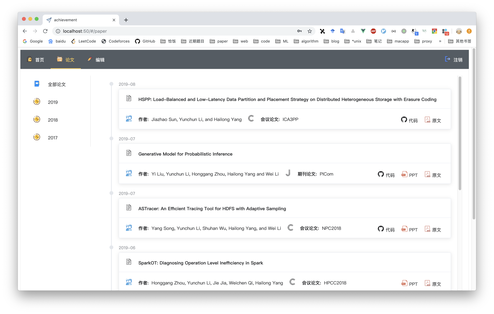
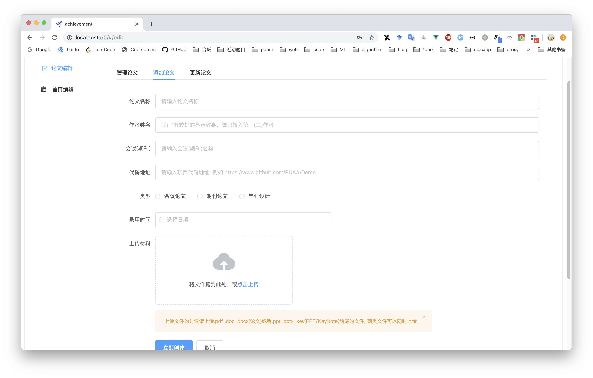
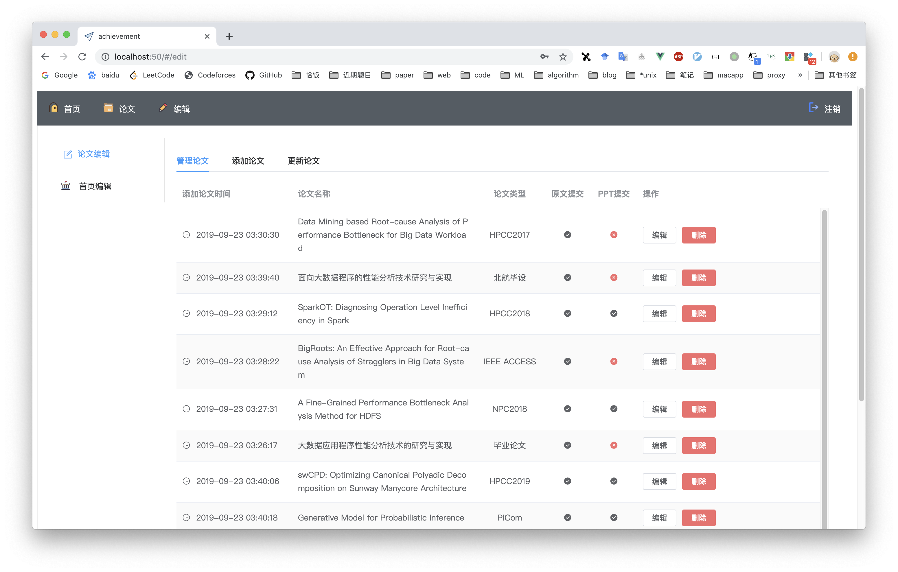

<h1 align="center">Welcome to LabAC 👋</h1>
<p>
  
</p>

> 展示实验室论文成果

基于gin, vue, docker-compose构建网站服务。网站效果图请[点击这里](#效果图)查看。

一个好的README会附上一个目录

## 目录

1. [部署指南](#部署指南)
2. [迁移指南](#迁移指南)
3. [开发指南](#开发指南)
4. [技术栈](#技术栈)
5. [TODO](#TODO)
6. [效果图](#效果图)

## 部署指南

1. 首先在要部署的机器上安装docker和docker-compose, docker的安装请根据机器系统参考网上的安装教程，docker-compose的安装建议使用 pip安装 (如果docker-compose下载较慢输入下面的代码,切换到豆瓣镜像)。

   ```shell
   pip install -i http://pypi.douban.com/simple/ --trusted-host=pypi.douban.com/simple docker-compose
   ```

2. 从仓库下载源码

   ```
   git clone https://github.com/yangsoon/LabAC.git
   ```

3. 如果你想快速搭建网站请 **直接跳到第4步** ，但是如果机器上已经 **有** 了golang1.12和nodejs的环境, 并且 **想试着在这个项目基础上进行开发** 请继续阅读,否则查看步骤4。

   因为golang官方docker镜像太大，为了减轻镜像下载时网络和机器硬盘空间的压力，后端服务的docker镜像选择基于Scratch构建，所以在启动服务之前请先在本地编译好后端代码。

   同时前端代码是使用vue-cli脚手架编写，build之后的文件没有放在仓库里面。所以如果有node环境，请先自己build。请参考 **[开发指南](#开发指南)**。

   具体步骤如下(前提是机器上已经有了golang1.12和nodejs的环境):

   1. 进入`labac-gin`目录，输入下面指令，会得到`labac`的可执行文件

      ```sh
      CGO_ENABLED=0 GOOS=linux go build -a -installsuffix cgo -o labac .
      ```

      > 编译所生成的可执行文件会依赖一些库，并且是动态链接。在这里因为使用的是 `scratch`镜像，它是空镜像，因此我们需要将生成的可执行文件静态链接所依赖的库。                              --[煎鱼的博客](https://eddycjy.gitbook.io/golang/di-3-ke-gin/golang-docker#san-zhong-xin-gou-jian-jing-xiang)

   2. 进入`labac-front`目录

      ```
      npm install
      npm run build
      ```

4. 请到[release](https://github.com/yangsoon/LabAC/releases)页面下载相关文件,把解压后的`labac`放在`labac-gin`文件夹内 ,`dist`文件放在`labac-front`文件夹内。

5. 在启动服务之前，有几个配置项需要配置一下

   1. `labac-gin/conf/app.ini`文件, 修改`JWT_SECRET`和`[admin]`下的值，`JWT_SECRET`是生成token的密钥请随机输入字母和数字的组合(这里我用了我的学号),而`[admin]`下的值就是登录网站时使用的用户名和密码。

      ```ini
      RUN_MODE = debug
      JWT_SECRET = zy1806311 
      ...
      [admin]
      USERNAME = admin
      PASSWORD = admin
      ```

   2. `docker-compose.yml`, 将yml文件中的`ports`端口映射部分改成`80:80`，docker-compose启动时,如果端口80被占用,可以修改为其他端口, 该选项一般不需要修改。除非出现执行第6步之后出现因为端口被占用导致的无法启动的问题。

      ```yml
      version: "3"
      services:
        labac-front:
          image: "nginx:latest"
          volumes:
            - ./labac-front/dist:/usr/share/nginx/html
            - ./compose-conf/nginx.conf:/etc/nginx/conf/nginx.conf
          ports:
            - "80:80"
      ...
      ```

6. 启动服务,在项目根目录下执行:

   ```sh
   docker-compose up -d
   ```

7. 放进大象，开玩笑的。这时候输入ip就能直接访问了。

## 迁移指南

如果遇到了机器故障，需要更换机器部署应用，但是又要保证数据一致性的话，请参考下面操作。操作的前提是原本机器上的文件没有损坏，需要保证项目根目录下的`resource`和`db`文件完好，这两个文件分别存储着论文PPT资源和redis数据库持久化数据。

1. 在新机器上下载项目代码
2. 将原本机器上的`resource`和`db`文件拷贝，并覆盖新机器上项目对应的文件。
3. 查看 **[部署指南](#部署指南)** 部署

## 开发指南

本项目采样前后端分离的形式进行开发。如果需要修改前端代码，请先配置好前端环境，你需要安装nodejs, vue-cli3。后端使用golang1.12，然后用docker-compose部署，下面列出我的开发环境,可以参考一下，前端应该对版本号没有严格的要求。

|      软件      |  版本号  |
| :------------: | :------: |
|      node      | v11.0.0  |
|      npm       | v6.11.3  |
|    vue-cli3    | v3.11.0  |
|     golang     | v1.12.8  |
|     docker     | v19.03.2 |
| docker-compose |  1.24.1  |

环境配好之后，就可以开发啦。

1. 前端: 本项目使用前后端分离的方式开发，你需要进入到`labac-front`目录下面执行`npm install`安装依赖，因为前后端要分别启动，所以前端启动之前要进入`/labac-front/src/store/modules`目录下面修改`app.js`文件中的baseUrl，换成后端的地址。例如`http://127.0.0.1:8000`

   ```js
   const app = {
     state :{
         activeMenu: "paper",
         activeTab: "viewPaper",
         editPaper: null,
         baseUrl: "",
     },
   ```

   后面就可以执行`npm run server`启动啦。

2. 后端启动的时候，进入`labac-gin`文件夹中执行`go run main.go`就可以启动，第一次执行的时候会下载依赖，可能比较慢。所有的api逻辑都放在了`labac-gin/routers/api/paper.go`中，`labac-gin/routers/router.go`存储着路由的映射关系。后端相关配置项放在了`labac-gin/conf/app.ini`文件中。

3. 本项目使用了3个docker容器，nginx容器上放静态文件，并将请求转发给存放后端容器中，redis容器负责存放数据。

4. 为了方便迁移，将一些相关文件从容器映射到本地，迁移的时候附带这这些文件就行。

## 技术栈

本项目前端代码使用[Element](https://element.eleme.cn/#/zh-CN)-基于 Vue 2.0 的桌面端组件库构建，后端使用golang编写的web框架[gin](https://gin-gonic.com/)提供restful api服务, 使用redis存储必要的数据。整个服务使用docker-compose部署。

1. 前端 vue+vuex+vue-router+axios+element
   1. 既然用vue写前端了，不管用到用不到都要上vue全家桶啦，前端没有什么想说的，基于一个理念就行：简单就是美，其实色彩越单调，结构越简单越好。
   2. 开发的时候，突然发现加入一些好看的图标，能够极大的美化页面，因为element自带的icon种类太少，我就从阿里的[icon库](https://www.iconfont.cn/)里面选择了一些比较好的icon。发现效果确实不错，大家以后也可以使用这上面的图标。
2. golang(gin)
   1. 后端 golang(gin) 之前一直用python写后端，这次第一次试水了golang,发现写起来并没有很难受，感觉gin写后端很容易上手，并不比flask或者tornado差。
   2. 而且golang的goroutine和channel简直不要太爽(这里没有用到，只是单纯的想夸一下golang)。
   3. 学习的时候，参考的[这篇博客](https://eddycjy.gitbook.io/golang/di-3-ke-gin),写的很不错。
3. docker-compose(nginx+golang+redis)
   1. 因为老板想让部署和迁移都比较方便，那就毫无疑问上docker啦，把一些数据映射到宿主机，迁移的时候，把容器映射到宿主机的文件拷贝出来再部署就可以恢复数据了。
   2. 其中我将前端放在nginx容器上，并用nginx做一层反向代理到golang容器中，其实这里的golang并不是一个golang的环境，只是存放了后端编译好的可执行程序。

## TODO

* [ ] 添加首页UI和首页可编辑功能

## 效果图

论文集



编辑-添加





## Author

👤 **yangsoon**

* Github: [@yangsoon](https://github.com/yangsoon)

## Show your support

Give a ⭐️ if this project helped you!

***
_This README was generated with ❤️ by [readme-md-generator](https://github.com/kefranabg/readme-md-generator)_
